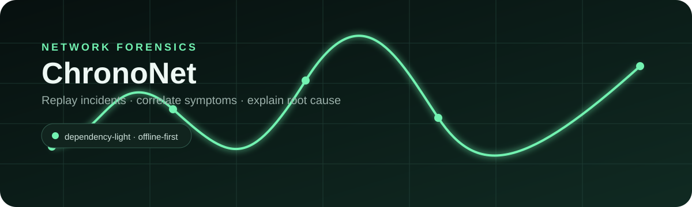

# ChronoNet — Network Incident Replay & Root-Cause Workbench

<p align="center"></p>

> Replay a network failure as a timeline, correlate symptoms across endpoints, estimate the blast radius, and produce an explainable root-cause hypothesis.

ChronoNet is a defensive network-forensics portfolio project built for network engineering, cybersecurity, and systems roles. It is intentionally **dependency-light**: the entire application runs with the Python standard library, so there is no npm install, Docker image, database server, or pip dependency required for the demo.

## Why this project is different

Many student networking projects stop at ping, port scanning, or topology diagrams. ChronoNet focuses on **incident reasoning**: it takes timestamped observations from several devices and reconstructs the failure sequence.

Current detectors can identify:

- DNS resolver degradation across multiple clients
- Default-gateway instability and packet-loss bursts
- Link flapping on an uplink/interface
- DHCP address-pool pressure

Each finding contains a **confidence score, evidence, severity, and recommended next diagnostic step**.

## Demo scenarios

| Scenario | What ChronoNet correlates |
| --- | --- |
| DNS Resolver Slowdown | slow/time-out DNS queries + application name-resolution failures + healthy gateway |
| Gateway / Uplink Instability | gateway loss across VLANs + repeated link-state transitions |
| DHCP Pool Exhaustion | lease failures across new clients while existing clients remain reachable |

## Run it

### Windows — easiest

Double-click `run.bat`, or from PowerShell:

```powershell
cd chrononet-network-incident-replay
py app.py
```

If `py` is not available:

```powershell
python app.py
```

Then open:

```text
http://127.0.0.1:8765
```

### Linux / macOS

```bash
./run.sh
```

No third-party package installation is required.

## Run the tests

```bash
python -m unittest discover -s tests -v
```

The repository also contains a GitHub Actions workflow that tests Python 3.11, 3.12, 3.13, and 3.14.

## API

| Method | Endpoint | Purpose |
| --- | --- | --- |
| GET | `/api/health` | application health |
| GET | `/api/scenarios` | list bundled incidents |
| GET | `/api/scenarios/{id}` | scenario + analysis |
| GET | `/api/scenarios/{id}/report` | generated Markdown incident report |
| POST | `/api/analyze` | analyze a custom event list |

Example custom payload:

```json
{
  "events": [
    {
      "timestamp": "2026-08-20T08:41:21Z",
      "source": "client-01",
      "target": "10.20.0.53",
      "type": "dns_query",
      "service": "DNS",
      "status": "timeout",
      "latency_ms": 2000,
      "severity": "high"
    }
  ]
}
```

## Repository structure

```text
chrononet-network-incident-replay/
├── app.py
├── chrononet/
│   ├── analyzer.py
│   └── report.py
├── data/scenarios/
│   ├── dhcp-pressure.json
│   ├── dns-storm.json
│   └── gateway-flap.json
├── web/
│   ├── app.js
│   ├── index.html
│   └── styles.css
├── tests/
├── docs/
└── .github/workflows/tests.yml
```

## Engineering choices

- Python standard library only for maximum portability
- Built-in threaded HTTP server for the local portfolio demo
- JSON fixtures for easy incident authoring
- Explainable rule-based correlation instead of opaque scoring
- Browser UI with no frontend build step
- Defensive-only sample data; no active scanning or packet capture

## Roadmap

- PCAP-derived event adapters (offline parsing only)
- Syslog / DHCP / DNS log import adapters
- Incident comparison mode
- Interface counter correlation
- Graph-based dependency map
- Signed incident evidence bundles

## Suggested GitHub repository details

**Repository name:** `chrononet-network-incident-replay`

**Description:** `Explainable network incident replay, symptom correlation, blast-radius analysis and root-cause reporting.`

**Topics:** `networking`, `cybersecurity`, `network-forensics`, `incident-response`, `python`, `observability`, `root-cause-analysis`, `systems`

## CV-ready description

**ChronoNet — Network Incident Replay & Root-Cause Workbench**  
Built a dependency-light network forensics application that replays timestamped incidents, correlates DNS/DHCP/gateway/link symptoms across endpoints, estimates blast radius, and produces explainable root-cause findings with confidence scores and remediation guidance. Implemented a Python HTTP/API layer, rule-based correlation engine, interactive JavaScript dashboard, automated tests, and GitHub Actions CI.

## License

MIT
